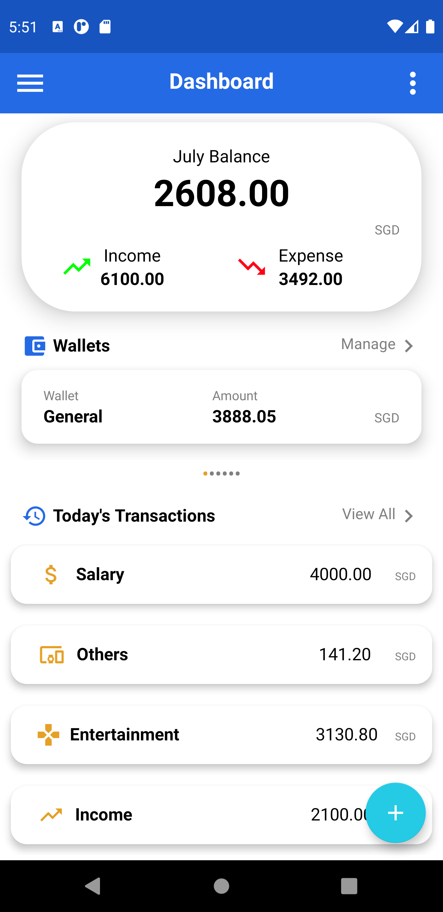
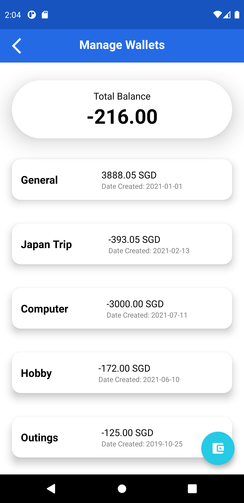

# MADT01 2021 - Group 5

  
  
  <h3 align="center">Spendid</h3>
  
Spendid is a mobile application made to help users track their expenses

  
Table of Contents

  <ol>
    <li>
      <a href="#about-the-project">About The Project</a>
      <ul>
        <li><a href="#developers">Developers</a></li>
      </ul>
    </li>
    <li><a href="#features">Features</a>
      <ul>
        <li>Creating/Editing/Deleting eWallets</li>
        <li>Creating/Editing/Deleting Transactions to put into existing eWallets</li>
        <li>Viewing all transactions/Finding specific transactions through filtering feature</li>
        <li>Currency Exchange for over 30 countries</li>
        <li>Shopping list to allow for better handling for grouped transactions</li>
        <li>Exporting of existing wallets and their transactions</li>
        <li>Importing of wallets onto users own application</li>
      </ul>
    </li>
    <li><a href="#contributing">Contributing</a></li>
    <li><a href="#contact">Contact</a></li>
    <li><a href="#acknowledgements">Acknowledgements</a></li>
  </ol>

## About the Project
Do you ever feel like you are spending too much money? Well,  50% of adults in Singapore do not have an idea on how much money they spend every month and roughly 70% of the population that track their monthly spendings usually don't overspend. In order to combat the problem of overspending, Spendid was made.

With the <a href="#features">features</a> included in Spendid, we are aiming to help people better manage their finances, by allowing them to track their daily expenses with ease.

### Developers
Done by: Glenn Kok, Chea Hong Li, Clarence Ow

## Features
<table>
  <tr>
    <th>Page</th>
    <th width="60%">Description</th>
    <th>Sample Image</th>
  <tr align="center">
    <td>Main Page</td>
    <td>
        The main page of Spendid provides an overview of the financial situation of the users. They can get a quick glance of their balance for the month, a summary of their eWallets and the transactions they have made on that day.
    </td>
    <td></td>
  </tr>
  
  <tr align="center">
    <td>eWallets</td>
    <td>
        This feature allows users to create eWallets to store their transactions in, for better organizational purposes. Adding an eWallet is quick and easy, simply tap on the  button to add a transaction and you will be directed to select a wallet.
    </td>
    <td></td>
  </tr>
</table>
    
